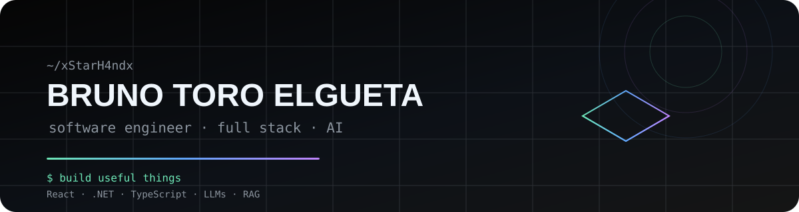

<div align="center">



<br/>

### SOFTWARE ENGINEER · FULL STACK · AI

**Construyo software que convierte problemas reales en soluciones útiles.**

<br/>

[](https://github.com/xStarH4ndx)
[](REEMPLAZA_CON_TU_LINKEDIN)
[](REEMPLAZA_CON_TU_PORTFOLIO)

</div>

---

## `01 / ABOUT ME`

```text
Bruno Toro Elgueta
Ingeniero Civil en Computación e Informática

▸ Desarrollo fullstack
▸ Integración de LLMs y APIs
▸ Arquitectura de aplicaciones
▸ Automatización y herramientas para problemas reales
▸ Interés actual: AI Engineering + RAG + Cloud

"El conocimiento crea valor cuando mejora la vida de otros."
```

Me interesa construir productos que sean **útiles, mantenibles y fáciles de usar**, combinando desarrollo de software, automatización e Inteligencia Artificial.

He trabajado en proyectos académicos y profesionales donde el foco no ha sido solamente programar, sino **entender el problema, conversar con usuarios y transformar una necesidad en una solución funcional**.

---

## `02 / TECH STACK`

<div align="center">

### Backend


### Frontend


### Data · AI · Infrastructure


<br/><br/>

**AI / RAG:** Gemini · Ollama · Mistral · Qdrant · Embeddings · Prompt Engineering

</div>

---

## `03 / SELECTED PROJECTS`

### 🚀 RadarOp — Radar de oportunidades

**Sistema de Evaluación y Gestión de Oportunidades de Financiamiento**

Plataforma desarrollada para facilitar la identificación y evaluación de oportunidades de financiamiento de **ANID y CORFO**.

```text
.NET 10 · React · TypeScript · PostgreSQL
FastAPI · Qdrant · Gemini · Docker · Azure
```

**Lo que desarrollé**

- Backend modular con .NET y Dapper.
- Frontend en React + TypeScript.
- Pipeline de scraping para fuentes de financiamiento.
- Sistema de matching semántico mediante embeddings.
- RAG para consultas sobre bases legales y convocatorias.
- Integración de LLM para asistencia contextual.

> Resultado del proyecto: reducción superior al **97%** en el tiempo de búsqueda y superior al **99%** en el tiempo de análisis, según las mediciones realizadas durante la validación.

---

### 🎵 LastWhisper — Web oficial

Plataforma web para presentar y administrar el contenido de un proyecto musical.

```text
React · TypeScript · Vite · shadcn/ui
Google Sheets · Apps Script · GitHub Actions
```

Una de las decisiones principales fue separar **presentación y administración de contenido**: el cliente puede actualizar información desde Google Sheets y la aplicación consume esos datos mediante Google Apps Script.

---

### 🩺 Lunara

Portfolio web desarrollado para una profesional independiente, con contenido administrable sin necesidad de modificar el código.

```text
React · TypeScript · Vite
Google Sheets · Apps Script · GitHub Pages
```

El objetivo fue crear una solución simple para que el contenido pueda mantenerse actualizado sin depender directamente del desarrollador.

---

## `04 / EXPERIENCE`

### Austranet SPA
**Software Engineer · Dic. 2025 — Jul. 2026**

Desarrollo de soluciones fullstack, integración de APIs y aplicaciones con Inteligencia Artificial.

Participación en el desarrollo de **RadarOp**, desde la definición técnica hasta su implementación y puesta en producción.

```text
Full Stack · APIs · AI · RAG · PostgreSQL · Azure
```

---

## `05 / HOW I WORK`

```text
01  Entender       →  comprender el problema antes de programar
02  Diseñar        →  elegir una solución simple y mantenible
03  Construir      →  desarrollar iterativamente
04  Validar        →  probar con usuarios y datos reales
05  Mejorar        →  aprender, medir y volver a iterar
```

Me gusta trabajar en equipos donde exista **comunicación abierta, aprendizaje constante y responsabilidad compartida**.

---

## `06 / GITHUB ACTIVITY`

<div align="center">


<br/>


</div>

---

## `07 / CURRENTLY`

```text
→ AI Engineering
→ LLM Applications
→ Retrieval-Augmented Generation
→ Software Architecture
→ Cloud & scalable APIs
→ Building products with real users
```

---

## `08 / LET'S CONNECT`

<div align="center">

**¿Tienes un proyecto, una idea o una oportunidad?**

Estoy abierto a conversar, aprender y construir.

<br/>

[](https://github.com/xStarH4ndx)
[](REEMPLAZA_CON_TU_LINKEDIN)

<br/><br/>

<sub>Built with curiosity · code · and a lot of ☕</sub>

</div>
